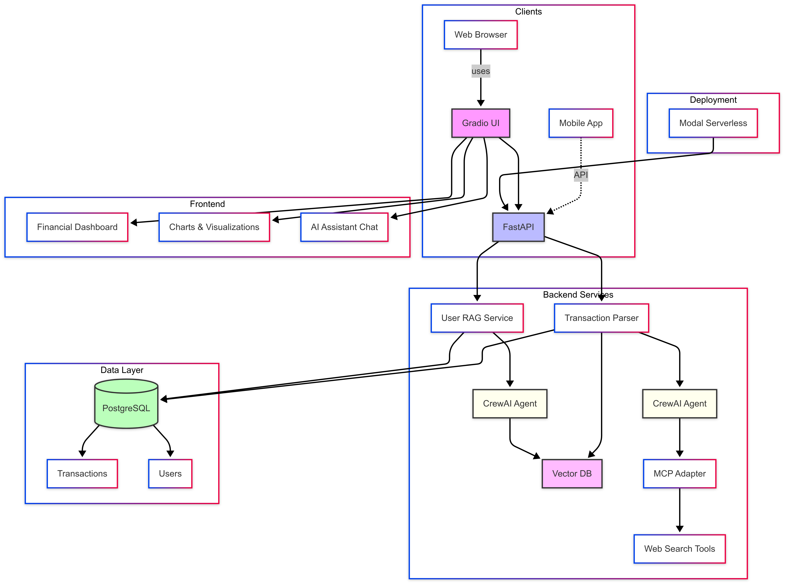
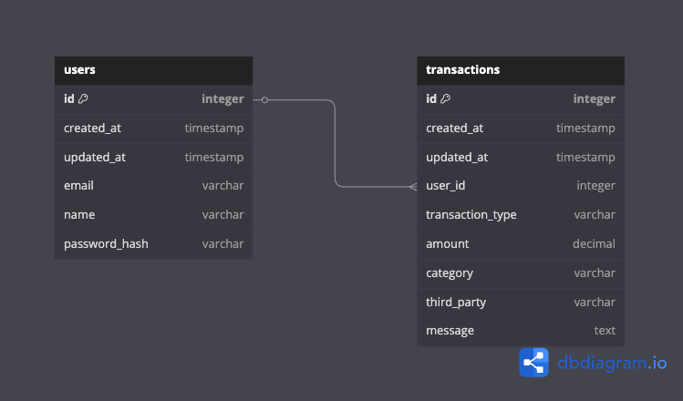

# GreenSmokeLabs-Expensynth

## Overview

GreenSmokeLabs-Expensynth is an AI-powered financial management platform designed to transform the way users track, analyze, and understand their expenses. By leveraging artificial intelligence and natural language processing, the system automatically categorizes transactions, provides financial insights, and offers an intelligent assistant for financial queries.

## System Architecture

The application is built on a robust three-tier architecture:



### Database Schema



## Key Components

### Backend

The backend is built with FastAPI and provides the following key services:

1. **Transaction Parsing Service**: Uses CrewAI to analyze and categorize financial transactions.
2. **User RAG Service**: Provides question-answering capabilities through Retrieval Augmented Generation.
3. **Database Layer**: PostgreSQL for structured data and Vector DB for embeddings.
4. **API Endpoints**: RESTful endpoints for all system functionalities.

### Frontend

The frontend is a Gradio-based web application with the following features:

1. **Financial Dashboard**: Shows key financial metrics and summaries.
2. **Interactive Charts**: Visualizes financial data through various charts and graphs.
3. **AI Assistant**: Chat interface for natural language queries about financial data.

### Mobile App

A mobile application will provide:

1. Transaction Message Categorization
2. Transaction Message Syncing
3. Mobile dashboard access

## Installation & Setup


### Prerequisites

- Python 3.10-3.12
- PostgreSQL
- Node.js (for optional frontend development)


### Backend Setup


1. Clone the repository:
   
```bash
   git clone https://github.com/yourusername/GreenSmokeLabs-Expensynth.git
   cd GreenSmokeLabs-Expensynth
   ```

2. Set up a Python virtual environment:
   
```bash
   python -m venv .venv
   source .venv/bin/activate  # On Windows: .venv\Scripts\activate
   ```

3. Install backend dependencies:
   
```bash
   cd backend
   pip install -e .
   ```

4. Configure environment variables:
   
```bash
   cp .env.example .env
   # Edit .env with your configuration
   ```

5. Run database migrations:
   
```bash
   alembic upgrade head
   ```

6. Start the backend server:
   
```bash
   uvicorn green_smoke_labs_expensynth.main:app --reload
   ```


### Frontend Setup


1. Install frontend dependencies:
   
```bash
   cd frontend
   pip install -r requirements.txt
   ```

2. Start the frontend server:
   
```bash
   python server.py
   ```


## Usage Guide


### Transaction Processing


1. Submit transaction messages through the API:
   
```bash
   curl -X POST http://localhost:8000/transaction-parsing/parse-transaction \
     -H "Content-Type: application/json" \
     -d '{"transaction_message": "You spent $75.40 at Whole Foods Market on June 10th, 2025"}'
   ```


2. The system will automatically:
   - Parse the transaction details
   - Categorize the transaction
   - Store it in the database
   - Update the vector embeddings for search


### Financial Dashboard

Access the dashboard at [http://localhost:7860](http://localhost:7860) to:

- View financial summaries
- Explore interactive charts
- Analyze spending patterns
- Query your financial data using natural language


### AI Assistant

Use the chatbot interface to ask questions such as:

- "What were my biggest expenses last month?"
- "How has my spending on groceries changed over time?"
- "What is my current balance?"


## API Documentation


### Transaction Parsing API

- `POST /transaction-parsing/parse-transaction`: Parse and process a new transaction
- `GET /transaction-parsing/transactions`: Get all transactions


### User Query API
- `POST /bot/query`: Submit a natural language query about financial data


### Health Check API
- `GET /health`: Check system health status


## Technologies Used


- **Backend**:
  - FastAPI
  - SQLAlchemy
  - CrewAI
  - Modal (serverless deployment)
  - Alembic (migrations)
  - Pydantic
  - PostgreSQL

- **Frontend**:
  - Gradio
  - Plotly
  - Pandas

- **AI & Machine Learning**:
  - Vector Embeddings
  - LLM APIs
  - CrewAI Agents
  - Retrieval Augmented Generation


## Future Roadmap


1. Mobile Application Development
2. Banking API Integrations
3. Advanced Financial Planning Features
4. Multi-currency Support
5. Budget Management
6. Export to Accounting Software


## Contributors


- Shrijeeth S ([shrijeethsuresh@gmail.com](mailto:shrijeethsuresh@gmail.com))
- Sethuram SV ([sethuram52001@gmail.com](mailto:sethuram52001@gmail.com))
- Shankar Mahadevan ([shankarmahadevan12901@gmail.com](mailto:shankarmahadevan12901@gmail.com))


## License

This project is proprietary and confidential. All rights reserved.

---

© 2025 Green Smoke Labs. All rights reserved.